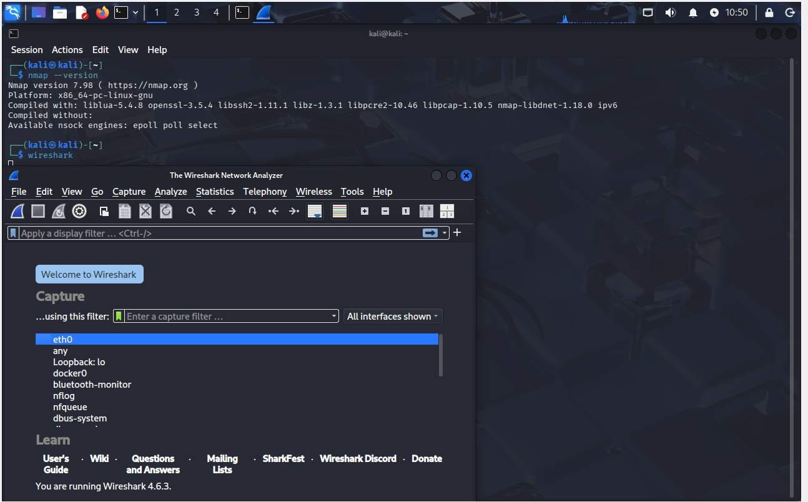
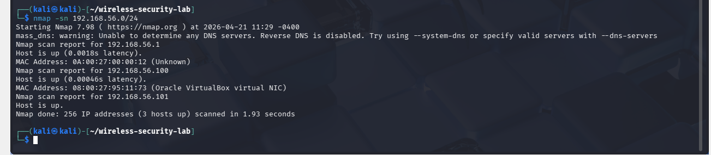
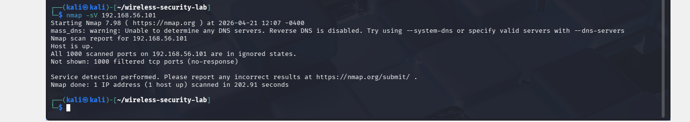
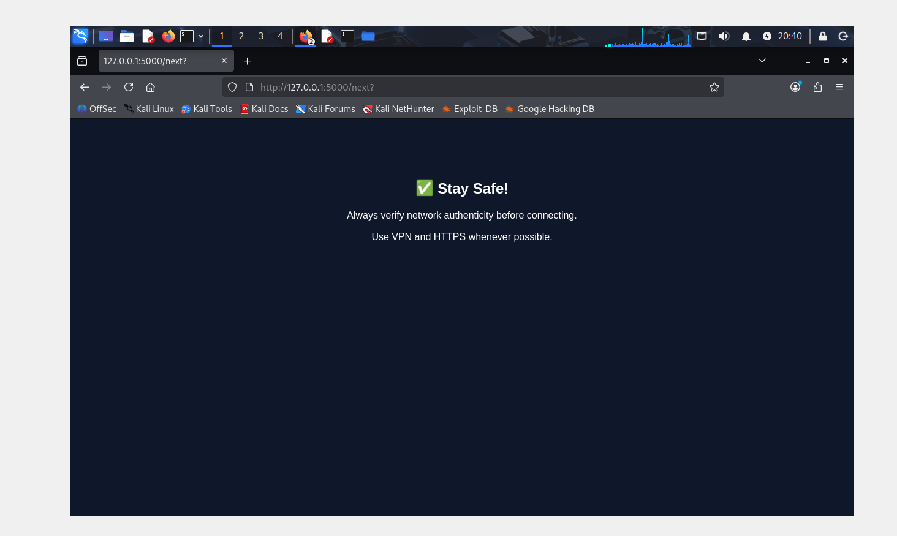
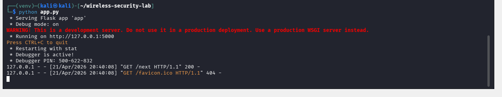
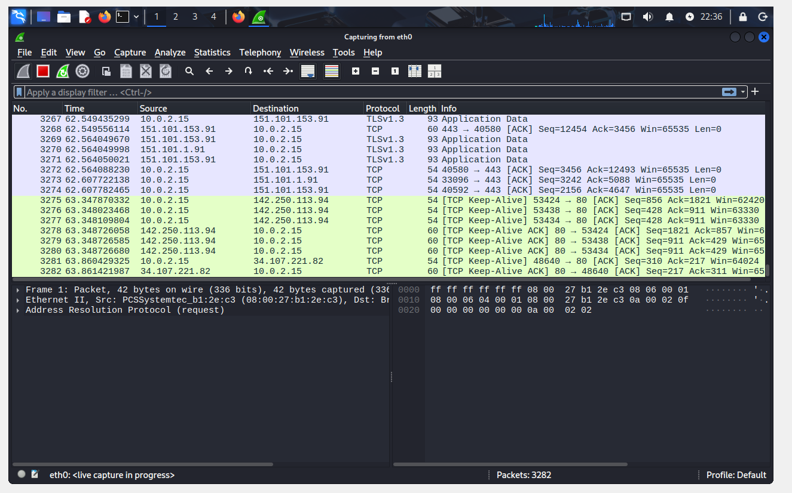
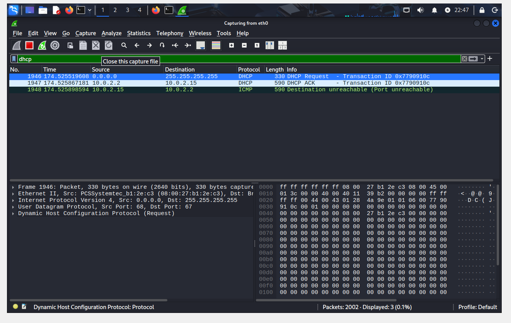
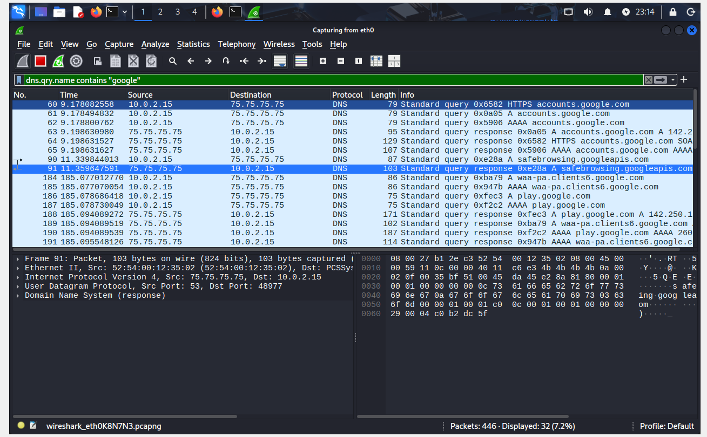
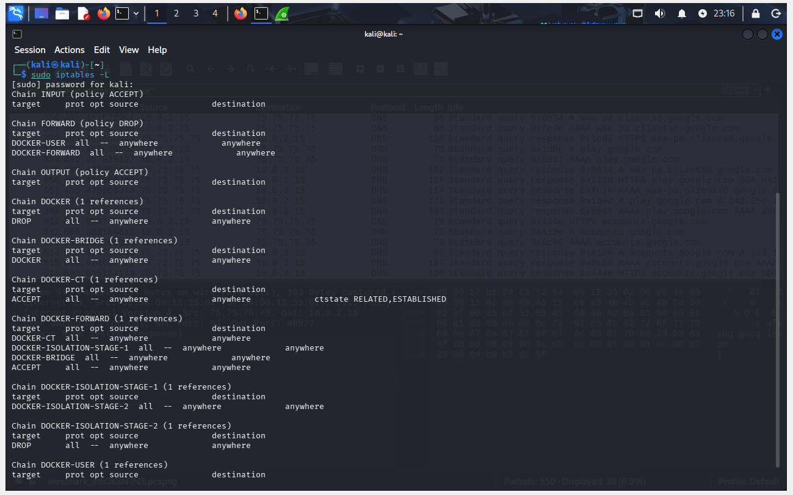

# Wireless Security Awareness and Rogue Access Point Detection Lab

## Overview
This project demonstrates a complete cybersecurity workflow including network reconnaissance, web-based security awareness, traffic analysis, and defensive techniques using Kali Linux.

## Tools Used
- Kali Linux
- Nmap
- Wireshark
- Flask (Python)
- iptables

## Project Phases

### — Network Reconnaissance
- Identified network configuration
- Performed host discovery using Nmap
- Conducted service scanning

### — Flask Awareness Application
- Built a web-based security awareness portal
- Simulated risks of public Wi-Fi networks
- Implemented user interaction flow

### — Network Traffic Analysis
- Captured live traffic using Wireshark
- Analyzed DNS, DHCP, and TCP protocols
- Observed encrypted traffic behavior

###  — Detection & Defense
- Detected TCP Reset (RST) packets
- Simulated blocked connections
- Analyzed firewall rules (iptables)
- Monitored DNS queries for suspicious domains

---

## Screenshots

### Network Reconnaissance
  
  
  
  

---

### Flask Awareness Portal
  
  
  

---

### Traffic Analysis (Wireshark)
  
  
  
  
  

---

### Detection & Defense
  
  
  
  

---

## 📄 Report
Full detailed report available in:
`Final_Wireless_Security_Report.pdf`

---

## Key Learning Outcomes
- Network reconnaissance using Nmap
- Web application development with Flask
- Network traffic analysis using Wireshark
- Detection of abnormal network behavior
- Basic firewall configuration and analysis

  ## ⚠️ Disclaimer
This project is for educational purposes only. All testing was performed in a controlled lab environment.

## Author
Rashed Rahman  
MS in Cybersecurity  
Houston Christian University
